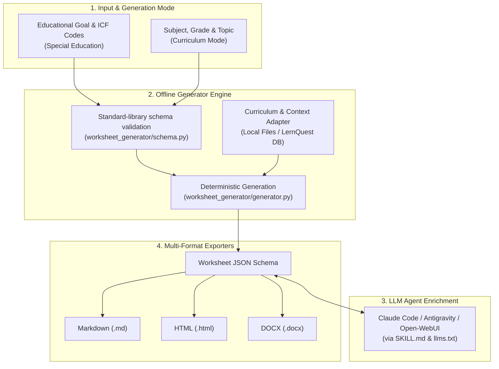

# worksheet-generator

[](LICENSE)
[](https://www.python.org/downloads/)
[](https://github.com/ellmos-ai/worksheet-generator/actions)
[](tests/)
[](#features)
[](llms.txt)
[](README_de.md)

**Educational and therapeutic worksheet generator driven by local LLM agents (Claude Code, Antigravity, Open-WebUI).**

**English** | [Deutsch](README_de.md)

> [!NOTE]
> **AI Agent & LLM Integration:** This repository provides machine-readable specifications (`llms.txt`, `SKILL.md`, and `worksheet_generator/schema.py`) designed for seamless integration with local AI agents to automate worksheet generation, differentiation, and content enrichment.

> [!IMPORTANT]
> **Privacy & Offline First:** The generator engine runs entirely offline and processes no client or personal data — it is controlled exclusively via abstract educational goals, ICF codes, or school curricula. The one exception is the optional helper `_tools/icf_fetch.py --who-api`, which contacts the WHO API for ICF short titles only when you explicitly run it (see [ICF reference](#icf-reference-bring-your-own)).

> [!TIP]
> **Ecosystem Integration:** Works out of the box with other `ellmos-ai` tools such as [report-forge](https://github.com/ellmos-ai/report-forge) (anonymized reporting pipelines), [USMC](https://github.com/ellmos-ai/usmc) (shared agent memory), and [ellmos-homebase-mcp](https://github.com/ellmos-ai/ellmos-homebase-mcp).

This module generates structured **worksheet JSONs** from an educational goal (free text + optional ICF codes), level, and age group, or school curriculum (subject, grade, topic), which can then be rendered to Markdown, HTML, or DOCX formats.

| Feature | Description |
|---|---|
| **Privacy & GDPR** | Local-first, offline engine. Zero personal or client data required. |
| **Generation Modes** | (1) Goal & ICF codes (Special Education) / (2) Subject, Grade & Topic (Curriculum) |
| **Export Formats** | Markdown, HTML, DOCX (optional via `python-docx`) |
| **AI Agent Ready** | Includes `llms.txt` and `SKILL.md` for native use in Claude Code, Antigravity & LLM pipelines |

---

**Status:** Beta (0.2.3) — per-version changes in [`CHANGELOG.md`](CHANGELOG.md).

**Note:** This is a *material generator*, not a therapy program and not a promise of treatment success. It does not replace professional judgement — review and adapt every generated worksheet before use.

---

## Installation

No mandatory dependencies — pure Python standard library (Python >= 3.10, for `X | Y` type annotations and `dataclasses`).

Install the package directly:

```bash
pip install -e .
```

Optional, for the DOCX renderer or test suite:

```bash
pip install -e ".[docx]"
# or for tests:
pip install -e ".[test]"
```

---

## Quick Start

### Python Library Usage

```python
from worksheet_generator import Foerderziel, generate_worksheet, save_worksheet
from worksheet_generator import renderers

ziel = Foerderziel(
    freitext="Mengen bis 10 erfassen",
    icf_codes=["d150"],
    niveau="einfache_sprache",
    alter="8",
    thema="mathe",
)
worksheet = generate_worksheet(ziel)
save_worksheet(worksheet, "output/worksheet.json")

print(renderers.to_markdown(worksheet))
```

### CLI Command Line

You can invoke the CLI either via the `worksheet-generator` command or via `python -m worksheet_generator`:

```bash
# Generate worksheet JSON (Special Education mode)
worksheet-generator generate \
  --freitext "Mengen bis 10 erfassen" --icf d150 --niveau einfache_sprache \
  --alter 8 --thema mathe --out output/worksheet.json

# Generate worksheet JSON (School Curriculum mode)
worksheet-generator generate \
  --subject Mathematik --grade 3 --topic "Einmaleins" --out output/worksheet.json

# Render to Markdown or HTML
worksheet-generator render \
  output/worksheet.json --format md

# Check status and optional renderer availability
worksheet-generator status
```

---

## Architecture & Workflow



---

## Export Renderers

| Renderer | Status | Dependencies |
|---|---|---|
| **Markdown** | Core, built-in | None (Standard Library) |
| **HTML** | Core, built-in | None (Standard Library) |
| **DOCX** | Core, optional | `pip install python-docx` |
| **PDF** | External | Convert from HTML (e.g. WeasyPrint / Chrome) |

---

## Configuration

The package embeds the defaults from `worksheet_generator/default_config.json`; the repository mirror is `config.json`. Local, unversioned overrides belong in `config.local.json` in the current project directory (gitignored) — template: `config.local.example.json`.

---

## Curriculum Mode

`--subject` switches from the special-education mode to the curriculum mode: subject plus `--grade`, `--topic`, and optionally `--level` (differentiation, e.g. G/M/E) and `--kompetenz` (comma-separated competency focus).

```bash
python -m worksheet_generator generate --subject Mathematik --grade 3 \
  --topic "Einmaleins" --out ab.json
```

Curriculum context is optional and comes from `curriculum_sources` in the config: `local-files` (your own curriculum excerpts as `.md`/`.json`) and `lernquest` (experimental, reads read-only from a local SQLite competency register via `db_path` or the `LERNQUEST_DB` environment variable). Excerpts are prompt *context*, not an authoritative source — curriculum fidelity remains the user's responsibility.

---

## ICF Reference (bring-your-own)

> This module bundles **no** ICF short titles or full texts. It uses official ICF codes purely as neutral identifiers. Short titles are fetched by the optional script directly from the source (WHO ICD-11 API / BfArM), so the current WHO/BfArM licence terms apply to each user individually (CC BY-ND 3.0 IGO, and § 5 (2) UrhG for the German edition). ICF © WHO; German edition © WHO/BfArM. **The MIT licence of this repository does not extend to ICF content.**

`_tools/icf_fetch.py` builds a local `icf_local.json` (code + short title, with source and retrieval date in the file header; gitignored, never part of the repository):

```bash
# Mode A: your own CSV/JSON source file, no network access
PYTHONIOENCODING=utf-8 python _tools/icf_fetch.py --source path/to/source.csv

# Mode B: live WHO API query (requires your own free registration at icd.who.int/icdapi)
WHO_ICD_CLIENT_ID=... WHO_ICD_CLIENT_SECRET=... \
PYTHONIOENCODING=utf-8 python _tools/icf_fetch.py --who-api --codes d150,d115 --lang de
```

Without `icf_local.json` the generator still works — ICF codes are then carried through without short titles.

---

## Tests

```bash
PYTHONIOENCODING=utf-8 python -m pytest tests/ -v
```

19 tests across three files: `tests/test_smoke.py` covers schema validation, a generator run on synthetic input, and the Markdown renderer; `tests/test_curriculum.py` covers the curriculum mode and its adapters; `tests/test_metadata.py` verifies the PEP 639, package-discovery, and packaged-configuration contracts. CI runs them on Linux and Windows against Python 3.10–3.13 and performs a separate installed-wheel smoke test.

---

## Ecosystem & Related Repositories

- [report-forge](https://github.com/ellmos-ai/report-forge): Anonymized report generation & document pipelines.
- [clirec](https://github.com/ellmos-ai/clirec): Record and playback terminal/GUI demonstrations.
- [USMC](https://github.com/ellmos-ai/usmc): Shared agent memory client for ellmos ecosystem.
- [ellmos-homebase-mcp](https://github.com/ellmos-ai/ellmos-homebase-mcp): Local-first LLM memory, knowledge, and swarm orchestration server.

---

## License

MIT License (see [LICENSE](LICENSE)).
