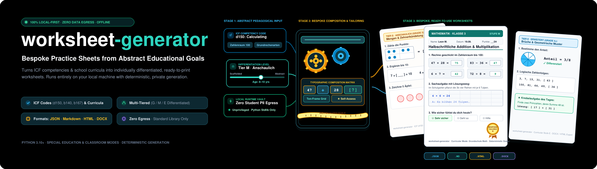
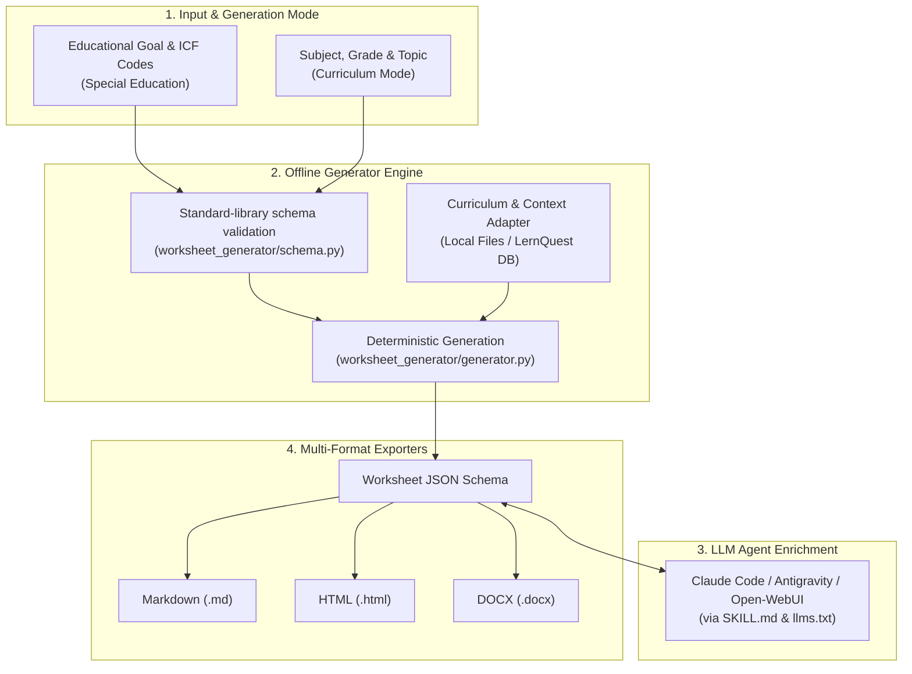

# worksheet-generator

[](LICENSE)
[](https://www.python.org/downloads/)
[](https://github.com/ellmos-ai/worksheet-generator/actions)
[](tests/)
[](#features)
[](llms.txt)
[](README_de.md)

**Educational and therapeutic worksheet generator driven by local LLM agents (Claude Code, Antigravity, Open-WebUI).**

**English** | [Deutsch](README_de.md)

> [!NOTE]
> **AI Agent & LLM Integration:** This repository provides machine-readable specifications (`llms.txt`, `SKILL.md`, and `worksheet_generator/schema.py`) designed for seamless integration with local AI agents to automate worksheet generation, differentiation, and content enrichment.

> [!IMPORTANT]
> **Privacy & Offline First:** `worksheet-generator` operates 100% offline with zero client or personal data processing. Controls operate exclusively via abstract educational goals, ICF codes, or school curricula.

> [!TIP]
> **Ecosystem Integration:** Works out of the box with other `ellmos-ai` tools such as [report-forge](https://github.com/ellmos-ai/report-forge) (anonymized reporting pipelines), [USMC](https://github.com/ellmos-ai/usmc) (shared agent memory), and [ellmos-homebase-mcp](https://github.com/ellmos-ai/ellmos-homebase-mcp).

This module generates structured **worksheet JSONs** from an educational goal (free text + optional ICF codes), level, and age group, or school curriculum (subject, grade, topic), which can then be rendered to Markdown, HTML, or DOCX formats.

| Feature | Description |
|---|---|
| **Privacy & GDPR** | Local-first, 100% offline engine. Zero personal or client data required. |
| **Generation Modes** | (1) Goal & ICF codes (Special Education) / (2) Subject, Grade & Topic (Curriculum) |
| **Export Formats** | Markdown, HTML, DOCX (optional via `python-docx`) |
| **AI Agent Ready** | Includes `llms.txt` and `SKILL.md` for native use in Claude Code, Antigravity & LLM pipelines |

---

## Quick Start

### Python Library Usage

```python
from worksheet_generator import Foerderziel, generate_worksheet, save_worksheet
from worksheet_generator import renderers

ziel = Foerderziel(
    freitext="Mengen bis 10 erfassen",
    icf_codes=["d150"],
    niveau="einfache_sprache",
    alter="8",
    thema="mathe",
)
worksheet = generate_worksheet(ziel)
save_worksheet(worksheet, "output/worksheet.json")

print(renderers.to_markdown(worksheet))
```

### CLI Command Line

```bash
# Generate worksheet JSON (Special Education mode)
PYTHONIOENCODING=utf-8 python -m worksheet_generator generate \
  --freitext "Mengen bis 10 erfassen" --icf d150 --niveau einfache_sprache \
  --alter 8 --thema mathe --out output/worksheet.json

# Generate worksheet JSON (School Curriculum mode)
PYTHONIOENCODING=utf-8 python -m worksheet_generator generate \
  --subject Mathematik --grade 3 --topic "Einmaleins" --out output/worksheet.json

# Render to Markdown or HTML
PYTHONIOENCODING=utf-8 python -m worksheet_generator render \
  output/worksheet.json --format md
```

---

## Architecture & Workflow



---

## Export Renderers

| Renderer | Status | Dependencies |
|---|---|---|
| **Markdown** | Core, built-in | None (Standard Library) |
| **HTML** | Core, built-in | None (Standard Library) |
| **DOCX** | Core, optional | `pip install python-docx` |
| **PDF** | External | Convert from HTML (e.g. WeasyPrint / Chrome) |

---

## Ecosystem & Related Repositories

- [report-forge](https://github.com/ellmos-ai/report-forge): Anonymized report generation & document pipelines.
- [clirec](https://github.com/ellmos-ai/clirec): Record and playback terminal/GUI demonstrations.
- [USMC](https://github.com/ellmos-ai/usmc): Shared agent memory client for ellmos ecosystem.
- [ellmos-homebase-mcp](https://github.com/ellmos-ai/ellmos-homebase-mcp): Local-first LLM memory, knowledge, and swarm orchestration server.

---

## License

MIT License (see [LICENSE](LICENSE)).
