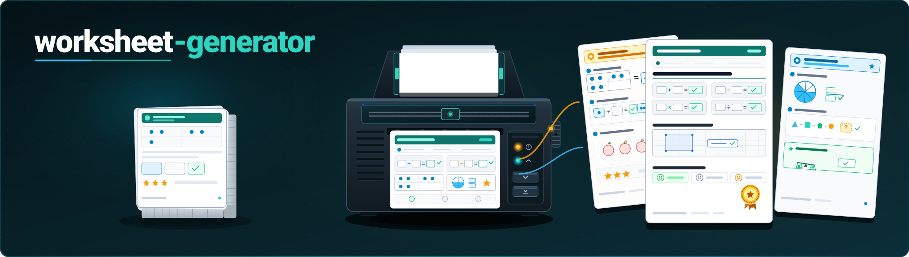
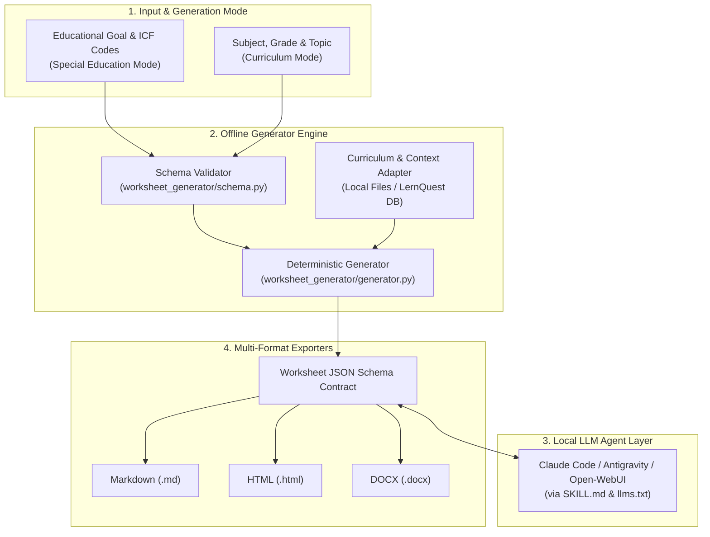
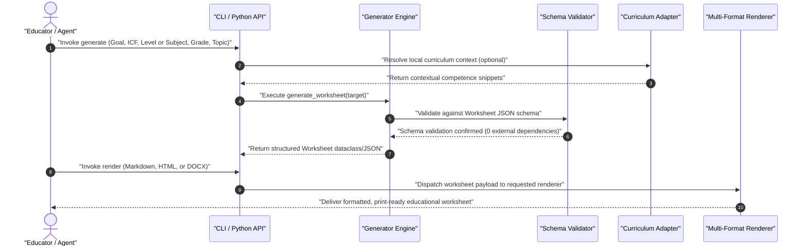

# worksheet-generator

<p align="center">
  <a href="LICENSE"></a>
  <a href="https://www.python.org/downloads/"></a>
  <a href="https://github.com/ellmos-ai/worksheet-generator/actions"></a>
  <a href="tests/"></a>
  <a href="#why-worksheet-generator"></a>
  <a href="#security--system-invariants"></a>
  <a href="https://github.com/ellmos-ai"></a>
  <a href="https://github.com/open-bricks"></a>
  <a href="llms.txt"></a>
  <a href="README_de.md"></a>
</p>

<p align="center">
  <b>English</b> | <a href="README_de.md">Deutsch</a>
</p>

> [!NOTE]
> **AI Agent & LLM Integration:** `worksheet-generator` provides machine-readable specifications ([`llms.txt`](llms.txt), [`SKILL.md`](SKILL.md), and standard library schemas in `worksheet_generator/schema.py`) designed for seamless integration with local AI agents (Claude Code, Antigravity, Open-WebUI) to automate worksheet generation, differentiation, and content enrichment.

> [!IMPORTANT]
> **Privacy & Offline First (Zero Egress):** The generator engine runs entirely offline and processes **zero client or personal data**—it is controlled exclusively via abstract educational goals, ICF codes, or school curricula. The one exception is the optional helper `_tools/icf_fetch.py --who-api`, which contacts the WHO API for ICF short titles only when you explicitly run it (see [ICF reference](#icf-reference--bring-your-own-model)).

> [!TIP]
> **Ecosystem Integration:** Works out of the box with other `ellmos-ai` tools such as [report-forge](https://github.com/ellmos-ai/report-forge) (anonymized reporting pipelines), [USMC](https://github.com/ellmos-ai/usmc) (shared agent memory), and [ellmos-homebase-mcp](https://github.com/ellmos-ai/ellmos-homebase-mcp).

---

## Quick Navigation

1. [What is worksheet-generator?](#what-is-worksheet-generator)
2. [Target Personas & Discoverability](#target-personas--discoverability)
3. [Architecture & System Flow](#architecture--system-flow)
4. [Generation & Export Lifecycle](#generation--export-lifecycle)
5. [Comparative Matrix vs. Alternatives](#comparative-matrix-vs-alternatives)
6. [Core Capabilities & Dual Modes](#core-capabilities--dual-modes)
7. [Getting Started & Installation](#getting-started--installation)
8. [Usage & Workflow](#usage--workflow)
9. [CLI Command Reference](#cli-command-reference)
10. [Export Renderers & Formats](#export-renderers--formats)
11. [Configuration & Local Overrides](#configuration--local-overrides)
12. [Curriculum Context & Adapters](#curriculum-context--adapters)
13. [ICF Reference & Bring-Your-Own Model](#icf-reference--bring-your-own-model)
14. [AI Agent & LLM Integration](#ai-agent--llm-integration)
15. [Third-Party Licenses & Transparency](#third-party-licenses--transparency)
16. [Contract Tests & Verification](#contract-tests--verification)

---

## What is worksheet-generator?

**worksheet-generator** is an unprivileged, local-first engine that generates structured, individualized worksheets for special education professionals, therapists, and classroom teachers. It bridges the gap between structured educational goal-planning and automated teaching material generation:

- **Special Education Mode:** Generates targeted practice materials from abstract educational goals, ICF codes (e.g. `d150` calculating, `b140` attention functions), differentiation levels (e.g. `einfache_sprache`, `anschaulich`), and target age groups.
- **Curriculum Mode:** Generates subject-specific worksheets from school subjects, grade levels, topics, and tiered difficulty levels (Basic / Medium / Advanced — G/M/E).
- **Multi-Format Export:** Outputs validated JSON, Markdown, clean HTML, and optional DOCX documents.
- **Zero Mandatory Dependencies:** Built entirely on the Python 3.10+ standard library.

> **Disclaimer:** This module is a *material generator*, not a therapy program and not a guarantee of treatment success. It does not replace professional diagnostic or pedagogical judgement—always review and adapt generated materials before classroom or clinical use.

---

## Target Personas & Discoverability

`worksheet-generator` is designed for four primary personas:

### `[PERSONA-01]` Special Education Teachers & Remedial Educators
- **Context:** Working in special education schools, inclusive classrooms, or remedial learning centers.
- **Need:** Highly individualized, small-step exercises aligned to individual educational plans (IEPs) and ICF development goals.
- **Why this tool:** Eliminates hours of manual differentiation while ensuring that confidential student learning plans never leave the local computer.

### `[PERSONA-02]` Speech-Language Pathologists & Occupational Therapists
- **Context:** Operating in private practices, social pediatric centers (SPZ), or pediatric clinics.
- **Need:** Targeted, age-appropriate home practice sheets addressing discrete cognitive, phonological, or fine-motor sub-skills.
- **Why this tool:** Complete compliance with strict medical confidentiality and GDPR; abstract goal parameterization guarantees zero patient identifiable data.

### `[PERSONA-03]` AI Agent Engineers & Pipeline Architects
- **Context:** Designing local multi-agent systems with Claude Code, Antigravity, Open-WebUI, or LangGraph.
- **Need:** Deterministic JSON schema contracts, standard-library validation (`schema.py`), and machine-readable context (`llms.txt`, `SKILL.md`).
- **Why this tool:** Provides a robust, non-hallucinating core schema that agents can programmatically inspect, populate, enrich, and convert without runtime fragility.

### `[PERSONA-04]` Mainstream Classroom Teachers & Department Chairs
- **Context:** Teaching heterogeneous elementary, middle, or high school classes.
- **Need:** Rapid generation of tiered practice sheets (Levels G, M, E) for math, German, or science topics without vendor lock-in.
- **Why this tool:** Free open-source tool (MIT) with instant Markdown and HTML generation, running without expensive cloud subscriptions.

---

## Architecture & System Flow



---

## Generation & Export Lifecycle



---

## Comparative Matrix vs. Alternatives

| Feature / Dimension | worksheet-generator | Worksheet Crafter | ChatGPT / Cloud LLMs | Eduki / Material Portals | Ad-Hoc DOCX Templates |
|---|---|---|---|---|---|
| **1. Privacy & Zero Egress** | **100% Local / Offline** | Local Desktop App | Cloud (External Egress) | Cloud Marketplace | Local |
| **2. ICF Goal Integration** | **Native Parameter** | Manual text only | Prompt-dependent | Static / Rare | None |
| **3. Machine Schema Contract** | **Standard JSON (`schema.py`)** | Proprietary binary | Unstructured text | None (PDF/DOCX) | None |
| **4. AI Agent Pipeline Ready** | **Native (`llms.txt`, `SKILL.md`)** | None | Web API only | None | None |
| **5. Tiered Differentiation** | **Automatic (G/M/E)** | Manual layout | Prompt-dependent | Separate files | Manual |
| **6. Multi-Format Rendering** | **MD, HTML, DOCX** | PDF, proprietary | Markdown only | PDF primarily | DOCX only |
| **7. Mandatory Dependencies** | **Zero (Python stdlib)** | Native C++/Qt runtime | Cloud subscription | Web browser / login | MS Office license |
| **8. Telemetry & User Accounts** | **None (RunAsInvoker)** | License validation | Mandatory account | Mandatory account | None |
| **9. Extensible Context Adapters** | **Yes (`curriculum_sources`)** | None | RAG pipeline needed | None | None |
| **10. License Model** | **MIT Open-Source** | Commercial Subscription | SaaS Subscription | Pay-per-item | Proprietary |

---

## Core Capabilities & Dual Modes

| Feature | Description |
|---|---|
| **Privacy & GDPR** | Local-first, offline engine. Zero personal or client data processed. |
| **Special Education Mode** | Generates exercises from goal descriptions, ICF codes, differentiation levels, and age groups. |
| **Curriculum Mode** | Generates worksheets from school subject, grade level, topic, and tiered difficulty (G/M/E). |
| **Multi-Format Export** | Built-in Markdown and clean HTML export; optional DOCX export. |
| **AI Agent Ready** | Machine-readable specifications for Claude Code, Antigravity, and autonomous LLM pipelines. |

---

## Getting Started & Installation

No mandatory external dependencies—pure Python standard library (Python >= 3.10):

```bash
# Clone the repository
git clone https://github.com/ellmos-ai/worksheet-generator.git
cd worksheet-generator

# Install in editable mode
pip install -e .
```

Optional dependencies for DOCX rendering or running test suites:

```bash
# For Microsoft Word (.docx) export:
pip install -e ".[docx]"

# For development and tests:
pip install -e ".[test]"
```

---

## Usage & Workflow

### Python Library Usage

```python
from worksheet_generator import Foerderziel, generate_worksheet, save_worksheet
from worksheet_generator import renderers

# 1. Define educational or therapeutic target
ziel = Foerderziel(
    freitext="Mengen bis 10 erfassen",
    icf_codes=["d150"],
    niveau="einfache_sprache",
    alter="8",
    thema="mathe",
)

# 2. Deterministic worksheet generation
worksheet = generate_worksheet(ziel)

# 3. Persist JSON schema contract
save_worksheet(worksheet, "output/worksheet.json")

# 4. Render to Markdown or HTML
md_output = renderers.to_markdown(worksheet)
html_output = renderers.to_html(worksheet)
print(md_output)
```

---

## CLI Command Reference

The command-line interface can be run via `worksheet-generator` or `python -m worksheet_generator`:

```bash
# Generate in Special Education mode (Goal & ICF)
worksheet-generator generate \
  --freitext "Mengen bis 10 erfassen" \
  --icf d150 \
  --niveau einfache_sprache \
  --alter 8 \
  --thema mathe \
  --out output/worksheet.json

# Generate in School Curriculum mode
worksheet-generator generate \
  --subject Mathematik \
  --grade 3 \
  --topic "Einmaleins" \
  --out output/ab_mathe.json

# Render JSON to Markdown
worksheet-generator render output/worksheet.json --format md

# Render JSON to HTML
worksheet-generator render output/worksheet.json --format html --out output/worksheet.html

# Render JSON to DOCX (requires python-docx)
worksheet-generator render output/worksheet.json --format docx --out output/worksheet.docx

# Inspect environment and renderer status
worksheet-generator status
```

---

## Export Renderers & Formats

| Renderer | Status | Dependencies | Output Character |
|---|---|---|---|
| **Markdown** | Core, built-in | Standard Library | Clean GitHub-flavored Markdown, suitable for terminal, Obsidian, or web view. |
| **HTML** | Core, built-in | Standard Library | Semantic HTML with embedded clean print styling (`@media print`). |
| **DOCX** | Core, optional | `pip install python-docx` | Editable Word document with formatted headers, exercise blocks, and solutions. |
| **PDF** | External | HTML print / WeasyPrint | Render to HTML first, then print to PDF via browser or headless Chrome. |

---

## Configuration & Local Overrides

Default configuration is embedded in `worksheet_generator/default_config.json` and mirrored in `config.json`.
Local, unversioned overrides belong in `config.local.json` (gitignored, template: `config.local.example.json`):

```json
{
  "default_niveau": "einfache_sprache",
  "default_alter": "8-10",
  "curriculum_sources": {
    "local_files": "path/to/curricula"
  }
}
```

---

## Curriculum Context & Adapters

The `--subject` flag switches into curriculum mode. Context adapters allow reading local syllabus excerpts as background context:
- `local-files`: Reads markdown or JSON excerpts from your designated local folders.
- `lernquest`: Experimental adapter reading read-only from a local SQLite competency register via `LERNQUEST_DB`.

Excerpts serve as prompt and generation *context*, not as authoritative legal curriculum sources.

---

## ICF Reference & Bring-Your-Own Model

> **Notice:** This repository bundles **no** ICF full texts, diagnostic descriptions, or short titles. ICF codes (`d150`, `b140`, etc.) are processed strictly as abstract alphanumeric identifiers.

The optional helper `_tools/icf_fetch.py` allows building a local, gitignored `icf_local.json`:
- **Mode A (Offline):** Provide your own CSV/JSON source file (`--source`).
- **Mode B (WHO API):** Query the official WHO ICD-11 / ICF API using your own free developer credentials.

ICF © World Health Organization (WHO); German edition © WHO / BfArM. **The MIT license of this repository does not cover ICF classification texts.**

---

## AI Agent & LLM Integration

`worksheet-generator` is optimized for autonomous AI agents:
- [`llms.txt`](llms.txt): Machine-readable overview of CLI commands, schemas, and file structure.
- [`SKILL.md`](SKILL.md): Actionable agent skill prompt for Claude Code, Antigravity, and toolchain orchestrators.
- **Workflow:** An agent calls `worksheet-generator generate` to create the baseline JSON, enriches the exercise content using local LLM capabilities, and executes `worksheet-generator render` to output the final printable documents.

---

## Third-Party Licenses & Transparency

Comprehensive license audit and transparency documentation is maintained in [`THIRD_PARTY_LICENSES.md`](THIRD_PARTY_LICENSES.md):
- **Core Runtime:** Python Standard Library (`PSF-2.0`). Zero mandatory external runtime dependencies.
- **Optional Dependencies:** `python-docx` (`MIT`).
- **Dev/Test Tooling:** `pytest` (`MIT`), `setuptools` (`MIT`).
- **Worksheet Output:** 100% Zero-Copyleft guarantee for generated user documents.

---

## Contract Tests & Verification

The test suite enforces metadata parity, package discovery integrity, schema validation, and rendering:

```bash
PYTHONIOENCODING=utf-8 python -m pytest tests/ -v
```

27 tests verify:
- PEP 639 and PEP 621 license and package-discovery contracts (`tests/test_metadata.py`).
- Schema validation and negative error cases (`tests/test_smoke.py`).
- Special education and curriculum generation modes (`tests/test_curriculum.py`).
- Markdown and HTML export correctness and escaping.

---

## Ecosystem & Sister Projects

Part of the **ellmos-ai** and **open-bricks** ecosystem:
- [report-forge](https://github.com/ellmos-ai/report-forge): Anonymized report generation and document pipelines.
- [clirec](https://github.com/ellmos-ai/clirec): Record and playback terminal/GUI demonstrations.
- [USMC](https://github.com/ellmos-ai/usmc): Shared agent memory client for ellmos ecosystem.
- [ellmos-homebase-mcp](https://github.com/ellmos-ai/ellmos-homebase-mcp): Local-first LLM memory, knowledge, and swarm orchestration server.

---

## License & Disclaimer

- **License:** MIT License (see [LICENSE](LICENSE)).
- **Medical & Educational Disclaimer:** This software is a material generation tool, not a diagnostic medical device or certified pedagogical therapy curriculum. All materials should be reviewed by qualified educators before classroom use.
