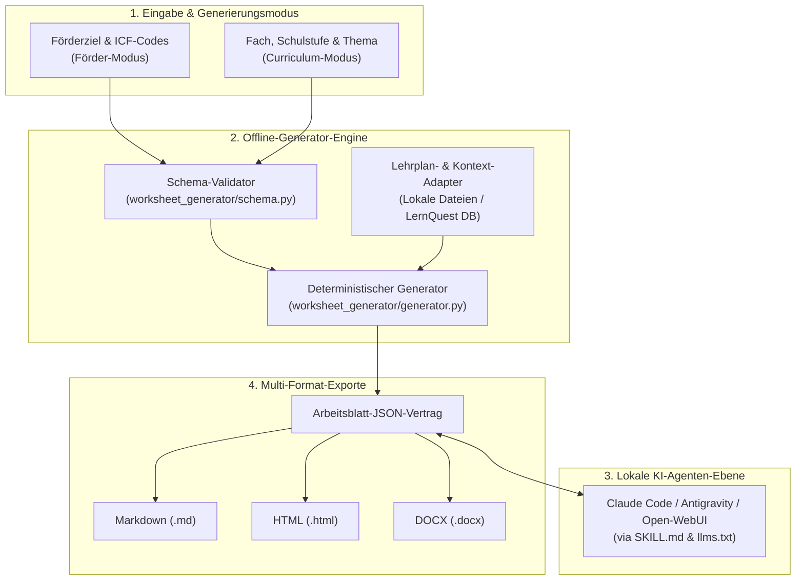
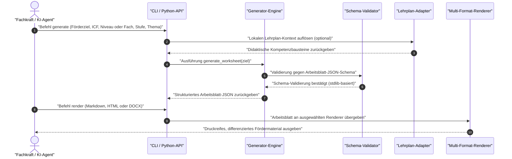

# worksheet-generator

<p align="center">
  <a href="LICENSE"></a>
  <a href="https://www.python.org/downloads/"></a>
  <a href="https://github.com/ellmos-ai/worksheet-generator/actions"></a>
  <a href="tests/"></a>
  <a href="#was-ist-worksheet-generator"></a>
  <a href="#sicherheit--system-invarianten"></a>
  <a href="https://github.com/ellmos-ai"></a>
  <a href="https://github.com/open-bricks"></a>
  <a href="llms.txt"></a>
  <a href="README.md"></a>
</p>

<p align="center">
  <a href="README.md">English Version</a> | <b>Deutsch</b>
</p>

> [!NOTE]
> **AI Agent & LLM-Integration:** `worksheet-generator` liefert maschinenlesbare Schnittstellen ([`llms.txt`](llms.txt), [`SKILL.md`](SKILL.md) und Schemadefinitionen in `worksheet_generator/schema.py`), die von lokalen KI-Agenten (Claude Code, Antigravity, Open-WebUI) direkt zur automatisierten Arbeitsblatt-Generierung, Differenzierung und inhaltlichen Anreicherung genutzt werden können.

> [!IMPORTANT]
> **Datenschutz & Privacy (Zero Egress):** Die Generator-Engine arbeitet vollständig offline und verarbeitet **keinerlei Klienten- oder Personendaten**—die Steuerung erfolgt ausschließlich über abstrakte Förderziele, ICF-Codes oder Schulcurricula. Einzige Ausnahme ist das optionale Hilfsskript `_tools/icf_fetch.py --who-api`, das nur auf ausdrückliche Anweisung des Nutzers ICF-Kurztitel bei der WHO-API abruft (siehe [ICF-Referenz](#icf-referenz--bring-your-own-prinzip)).

> [!TIP]
> **Ökosystem-Integration:** Funktioniert nahtlos zusammen mit anderen Tools aus dem `ellmos-ai`-Ökosystem wie [report-forge](https://github.com/ellmos-ai/report-forge) (anonymisierbare Berichts-Pipelines), [USMC](https://github.com/ellmos-ai/usmc) (Shared Agent Memory) und [ellmos-homebase-mcp](https://github.com/ellmos-ai/ellmos-homebase-mcp).

---

## Schnellnavigation

1. [Was ist worksheet-generator?](#was-ist-worksheet-generator)
2. [Zielgruppen & Auffindbarkeit](#zielgruppen--auffindbarkeit)
3. [Systemarchitektur & Ablauf](#systemarchitektur--ablauf)
4. [Generierungs- & Export-Lebenszyklus](#generierungs--export-lebenszyklus)
5. [Vergleichsmatrix gegenüber Alternativen](#vergleichsmatrix-gegenueber-alternativen)
6. [Kernfunktionen & Zwei Generierungsmodi](#kernfunktionen--zwei-generierungsmodi)
7. [Schnellstart & Installation](#schnellstart--installation)
8. [Nutzung & Arbeitsablauf](#nutzung--arbeitsablauf)
9. [CLI-Befehlsreferenz](#cli-befehlsreferenz)
10. [Export-Renderer & Formate](#export-renderer--formate)
11. [Konfiguration & lokale Anpassungen](#konfiguration--lokale-anpassungen)
12. [Lehrplan-Kontext & Adapter](#lehrplan-kontext--adapter)
13. [ICF-Referenz & Bring-Your-Own-Prinzip](#icf-referenz--bring-your-own-prinzip)
14. [KI-Agenten- & LLM-Integration](#ki-agenten---llm-integration)
15. [Drittanbieter-Lizenzen & Transparenz](#drittanbieter-lizenzen--transparenz)
16. [Vertragstests & Verifikation](#vertragstests--verifikation)

---

## Was ist worksheet-generator?

**worksheet-generator** ist eine unprivilegierte, lokale Open-Source-Engine zur Erstellung strukturierter, individualisierter Arbeitsblätter und Fördermaterialien für pädagogische Fachkräfte, Therapeuten und Lehrkräfte. Es schließt die Lücke zwischen strukturierter Förderplanung und automatisierter Materialerstellung:

- **Förder-Modus (Sonderpädagogik):** Erzeugt differenzierte Übungen aus abstrakten Förderzielen, ICF-Codes (z. B. `d150` Rechnen, `b140` Aufmerksamkeitsfunktionen), Niveaustufen (z. B. `einfache_sprache`, `anschaulich`) und Altersgruppen.
- **Curriculum-Modus (Regelschule):** Erzeugt fachspezifische Arbeitsblätter aus Schulfach, Jahrgangsstufe, Thema und Niveaudifferenzierung (Grundlegendes / Mittleres / Erweitertes Niveau — G/M/E).
- **Multi-Format-Export:** Gibt validiertes JSON, formatiertes Markdown, responsives HTML mit Drucklayout und optional DOCX-Dokumente aus.
- **Reine Standardbibliothek:** 0 externe Pflicht-Laufzeitabhängigkeiten auf Python 3.10+.

> **Hinweis:** Dieses Modul ist ein *Material-Generator*, kein Therapieprogramm und kein Heilversprechen. Es ersetzt keine fachliche Einschätzung durch qualifizierte Fachkräfte—erzeugte Arbeitsblätter sind vor dem Einsatz fachlich zu prüfen und anzupassen.

---

## Zielgruppen & Auffindbarkeit

`worksheet-generator` richtet sich an vier zentrale Zielgruppen:

### `[PERSONA-01]` Förderschullehrkräfte & Sonderpädagogen
- **Kontext:** Unterricht an Förderzentren, Inklusionsschulen oder Förderschwerpunkten (Lernen, Sprache, geistige Entwicklung).
- **Bedarf:** Passgenaue, kleinschrittige Fördermaterialien abgestimmt auf individuelle Förderpläne (IEP) und ICF-Entwicklungsziele.
- **Mehrwert:** Erspart zeitraubende manuelle Differenzierung; vertrauliche Schülerförderdaten verlassen zu keinem Zeitpunkt das lokale Gerät.

### `[PERSONA-02]` Sprachtherapeuten, Logopäden & Ergotherapeuten
- **Kontext:** Fachkräfte in freien Praxen, Sozialpädiatrischen Zentren (SPZ) oder Reha-Einrichtungen.
- **Bedarf:** Gezielte Übungsblätter für motorische, sprachliche oder kognitive Teilfunktionen als strukturiertes Heimübungsmaterial.
- **Mehrwert:** Volle Einhaltung der ärztlichen Schweigepflicht und DSGVO; abstrakte Zielsteuerung verhindert jede Übertragung von Patientendaten.

### `[PERSONA-03]` KI-Agenten-Entwickler & Pipeline-Architekten
- **Kontext:** Aufbau autonomer lokaler Multi-Agenten-Systeme (Claude Code, Antigravity, Open-WebUI, LangGraph).
- **Bedarf:** Deterministische Schemavalidierung (`schema.py`), maschinenlesbarer Kontext (`llms.txt`, `SKILL.md`) und Null Abhängigkeitskonflikte.
- **Mehrwert:** Berechenbare, typensichere Schnittstelle, die lokale Modelle fehlerfrei ansteuern, erweitern und formatieren können.

### `[PERSONA-04]` Regelschullehrkräfte & Fachschaftsleiter
- **Kontext:** Fachunterricht in heterogenen Grund-, Gesamt- und Sekundarschulklassen.
- **Bedarf:** Schnelle Differenzierung (G/M/E-Niveau) für Übungsphasen in Mathematik, Deutsch oder Sachunterricht nach Lehrplan.
- **Mehrwert:** Lizenzkostenfreie Open-Source-Software (MIT) mit direktem Druck- und Word-Export ohne proprietären Vendor-Lock-in.

---

## Systemarchitektur & Ablauf



---

## Generierungs- & Export-Lebenszyklus



---

## Vergleichsmatrix gegenüber Alternativen

| Kriterium / Dimension | worksheet-generator | Worksheet Crafter | ChatGPT / Cloud LLMs | Eduki / Materialportale | Ad-Hoc DOCX Vorlagen |
|---|---|---|---|---|---|
| **1. Datenschutz & Zero Egress** | **100 % Lokal / Offline** | Lokal (Desktop-App) | Cloud (Datenabfluss) | Cloud-Marktplatz | Lokal |
| **2. ICF-Förderziel-Fokus** | **Nativer Parameter** | Manuell | Nur via Custom Prompt | Statisch pro PDF | Keiner |
| **3. Maschinen-JSON-Schema** | **Standard (`schema.py`)** | Proprietär binär | Unstrukturierter Text | Keines (PDF/DOCX) | Keines |
| **4. KI-Agenten-Integration** | **Nativ (`llms.txt`, `SKILL.md`)** | Keine | Proprietäre Web-API | Keine | Keine |
| **5. Niveaustufen-Differenzierung** | **Automatisch (G/M/E)** | Manuell | Prompt-abhängig | Getrennte Dateien | Manuell |
| **6. Multi-Format-Renderer** | **MD, HTML, DOCX** | PDF, eigenes Format | Nur Markdown | Meist nur PDF | Nur DOCX |
| **7. Pflicht-Abhängigkeiten** | **0 (Python stdlib)** | C++/Qt-Installer | Cloud-Abo + API-Key | Browser / Login | MS Office Lizenz |
| **8. Telemetrie & Accounts** | **Keine (RunAsInvoker)** | Lizenzschlüssel-Prüfung | Account & Tracking | Account & Bezahlung | Variiert |
| **9. Lokale Kontext-Adapter** | **Ja (`curriculum_sources`)** | Keine | RAG-Server nötig | Keine | Keine |
| **10. Lizenzmodell** | **MIT Open-Source** | Proprietär (Abonnement) | SaaS-Abonnement | Pay-per-Item | Variiert |

---

## Kernfunktionen & Zwei Generierungsmodi

| Eigenschaft | Beschreibung |
|---|---|
| **Privacy & DSGVO** | Local-First, offline arbeitende Engine. Kein Personen- oder Klientenbezug. |
| **Förder-Modus** | Erzeugt Übungen aus Förderziel-Freitext, ICF-Codes, Differenzierungsniveau und Alter. |
| **Curriculum-Modus** | Erzeugt Arbeitsblätter aus Fach, Schuljahrgang, Thema und Niveaustufe (G/M/E). |
| **Multi-Format-Export** | Integrierte Markdown- und HTML-Renderer; optionaler DOCX-Word-Export. |
| **AI Agent Ready** | Maschinenlesbare Spezifikationen für Claude Code, Antigravity und LLM-Toolchains. |

---

## Schnellstart & Installation

Keine externen Pflicht-Abhängigkeiten—reine Python-Standardbibliothek (Python ≥ 3.10):

```bash
# Repository klonen
git clone https://github.com/ellmos-ai/worksheet-generator.git
cd worksheet-generator

# Paket im Entwicklungsmodus installieren
pip install -e .
```

Optionale Abhängigkeiten für DOCX-Export oder Testsuite:

```bash
# Für Microsoft Word (.docx) Export:
pip install -e ".[docx]"

# Für Tests und Entwicklung:
pip install -e ".[test]"
```

---

## Nutzung & Arbeitsablauf

### Als Python-Bibliothek

```python
from worksheet_generator import Foerderziel, generate_worksheet, save_worksheet
from worksheet_generator import renderers

# 1. Förderziel definieren
ziel = Foerderziel(
    freitext="Mengen bis 10 erfassen",
    icf_codes=["d150"],
    niveau="einfache_sprache",
    alter="8",
    thema="mathe",
)

# 2. Deterministische Arbeitsblatt-Generierung
worksheet = generate_worksheet(ziel)

# 3. JSON-Schema-Vertrag speichern
save_worksheet(worksheet, "output/worksheet.json")

# 4. Nach Markdown oder HTML rendern
md_text = renderers.to_markdown(worksheet)
html_text = renderers.to_html(worksheet)
print(md_text)
```

---

## CLI-Befehlsreferenz

Die Steuerung erfolgt wahlweise über `worksheet-generator` oder `python -m worksheet_generator`:

```bash
# Generierung im Förder-Modus (Förderziel & ICF)
worksheet-generator generate \
  --freitext "Mengen bis 10 erfassen" \
  --icf d150 \
  --niveau einfache_sprache \
  --alter 8 \
  --thema mathe \
  --out output/worksheet.json

# Generierung im Curriculum-Modus (Fach & Klasse)
worksheet-generator generate \
  --subject Mathematik \
  --grade 3 \
  --topic "Einmaleins" \
  --out output/ab_mathe.json

# Arbeitsblatt-JSON nach Markdown rendern
worksheet-generator render output/worksheet.json --format md

# Arbeitsblatt-JSON nach HTML rendern
worksheet-generator render output/worksheet.json --format html --out output/worksheet.html

# Arbeitsblatt-JSON nach DOCX rendern (benötigt python-docx)
worksheet-generator render output/worksheet.json --format docx --out output/worksheet.docx

# System- und Renderer-Status prüfen
worksheet-generator status
```

---

## Export-Renderer & Formate

| Renderer | Status | Abhängigkeiten | Format-Eigenschaften |
|---|---|---|---|
| **Markdown** | Core, integriert | Standardbibliothek | Sauberes GitHub-Flavored Markdown, optimal für Terminals, Obsidian oder Notizen. |
| **HTML** | Core, integriert | Standardbibliothek | Semantisches HTML mit integrierten CSS-Druckstilen (`@media print`). |
| **DOCX** | Core, optional | `pip install python-docx` | Editierbares Word-Dokument mit Tabellen, Kopfzeilen und Lösungsteil. |
| **PDF** | Extern | HTML-Druck / WeasyPrint | Nach HTML rendern, anschließend direkt im Browser oder headless als PDF drucken. |

---

## Konfiguration & lokale Anpassungen

Standardkonfigurationen sind in `worksheet_generator/default_config.json` eingebettet und in `config.json` gespiegelt.
Lokale, unversionierte Überschreibungen gehören in `config.local.json` (gitignored, Vorlage: `config.local.example.json`):

```json
{
  "default_niveau": "einfache_sprache",
  "default_alter": "8-10",
  "curriculum_sources": {
    "local_files": "pfad/zu/curricula"
  }
}
```

---

## Lehrplan-Kontext & Adapter

Der Schalter `--subject` aktiviert den Curriculum-Modus. Kontext-Adapter ermöglichen die Einbindung lokaler Lehrplanauszüge als didaktischen Hintergrund:
- `local-files`: Liest Markdown- oder JSON-Auszüge aus einem lokalen Projektverzeichnis.
- `lernquest`: Experimenteller Adapter, der schreibgeschützt aus einer lokalen SQLite-Kompetenzdatenbank via `LERNQUEST_DB` liest.

Lehrplanauszüge dienen als Prompt- und Strukturierungskontext, nicht als rechtsverbindliche Lehrplanquelle.

---

## ICF-Referenz & Bring-Your-Own-Prinzip

> **Rechtlicher Hinweis:** Dieses Repository enthält **keine** ICF-Kurztitel, diagnostischen Texte oder Volltexte. ICF-Codes (`d150`, `b140` etc.) werden ausschließlich als neutrale alphanumerische Identifikatoren verarbeitet.

Das optionale Skript `_tools/icf_fetch.py` ermöglicht den Aufbau einer lokalen, unversionierten `icf_local.json`:
- **Modus A (Offline):** Eigene CSV-/JSON-Quelldatei angeben (`--source`).
- **Modus B (WHO API):** Offizielle WHO-ICD-11-/ICF-Schnittstelle über eigene kostenfreie Entwickler-Zugangsdaten abfragen.

ICF © World Health Organization (WHO); deutsche Fassung © WHO / BfArM (§ 5 Abs. 2 UrhG). **Die MIT-Lizenz dieses Repositories erstreckt sich nicht auf ICF-Klassifikationstexte.**

---

## KI-Agenten- & LLM-Integration

`worksheet-generator` ist für die autonome Steuerung durch KI-Agenten optimiert:
- [`llms.txt`](llms.txt): Maschinenlesbare Übersicht der Befehle, Schemata und Dateistrukturen.
- [`SKILL.md`](SKILL.md): Direkt ausführbare Skill-Anweisung für Claude Code, Antigravity und LLM-Orchestratoren.
- **Workflow:** Ein Agent ruft `worksheet-generator generate` auf, um das Basis-JSON zu erzeugen, reichert die Übungen mithilfe lokaler LLM-Fähigkeiten an und führt `worksheet-generator render` aus, um das druckfertige Dokument zu erstellen.

---

## Drittanbieter-Lizenzen & Transparenz

Umfassende Lizenz- und Transparenzinformationen sind in [`THIRD_PARTY_LICENSES.md`](THIRD_PARTY_LICENSES.md) dokumentiert:
- **Kern-Laufzeit:** Python Standardbibliothek (`PSF-2.0`). 0 externe Laufzeit-Pflichtabhängigkeiten.
- **Optionale Bibliotheken:** `python-docx` (`MIT`).
- **Entwicklungs- & Testwerkzeuge:** `pytest` (`MIT`), `setuptools` (`MIT`).
- **Material-Ausgabe:** 100 % Zero-Copyleft-Garantie für alle erzeugten Arbeitsblätter und Exporte.

---

## Vertragstests & Verifikation

Die Testsuite stellt Metadaten-Parität, Schema-Validierung und Renderer-Integrität sicher:

```bash
PYTHONIOENCODING=utf-8 python -m pytest tests/ -v
```

24 Tests prüfen:
- PEP 639 und PEP 621 Lizenz- und Paketfindungskontrakte (`tests/test_metadata.py`).
- Schemavalidierung und Fehlerabfang bei ungültigen Eingaben (`tests/test_smoke.py`).
- Förder- und Curriculum-Generierungsmodi (`tests/test_curriculum.py`).
- Korrekte Markdown- und HTML-Formatierung und HTML-Escaping.

---

## Ökosystem & Verwandte Tools

Teil des **ellmos-ai**- und **open-bricks**-Ökosystems:
- [report-forge](https://github.com/ellmos-ai/report-forge): Anonymisierte Berichterstellung und Dokumenten-Pipelines.
- [clirec](https://github.com/ellmos-ai/clirec): Terminal- und GUI-Demonstrationen aufzeichnen und abspielen.
- [USMC](https://github.com/ellmos-ai/usmc): Shared Agent Memory Client für das ellmos-Ökosystem.
- [ellmos-homebase-mcp](https://github.com/ellmos-ai/ellmos-homebase-mcp): Lokaler Speicher-, Wissens- und Swarm-Orchestrations-Server.

---

## Lizenz & Haftungsausschluss

- **Lizenz:** MIT-Lizenz (siehe [LICENSE](LICENSE)).
- **Medizinischer & Pädagogischer Haftungsausschluss:** Diese Software ist ein Material-Generator, kein Medizinprodukt und kein zertifiziertes Therapiecurriculum. Sämtliche Materialien sind vor der Verwendung im Unterricht oder in der Therapie von qualifizierten Fachkräften zu prüfen.
